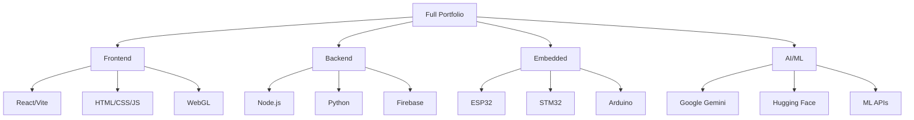

# 👋 Hi, I'm Henock Mukonkole (HorizonHnk)

<div align="center">

### Computer Engineering Portfolio
### 90 Technical Projects | Software • IoT • AI • Web Development

[](https://github.com/henockhnk092-dot)
[](https://github.com/henockhnk092-dot)

</div>

---

## 🎯 About Me

I'm a **Computer Engineer** specializing in **software development**, **IoT/embedded systems**, and **AI integration**. My portfolio showcases **90 technical projects** spanning multiple engineering domains, demonstrating expertise in full-stack development, embedded systems, and intelligent automation solutions.

> 💡 **Portfolio Focus:** Practical, production-ready solutions that solve real-world problems across healthcare, environmental monitoring, automation, and education sectors.

---

## 🚀 Technical Expertise

### Programming Languages


### Frameworks & Libraries


### Embedded Systems & IoT


### Cloud & Databases


### AI & Machine Learning


---

## 📊 Portfolio Statistics

<div align="center">

| Metric | Count |
|--------|-------|
| **Total Projects** | 90 |
| **GitHub Stars Received** | 13+ |
| **Project Forks** | 4+ |
| **Live Deployments** | 22+ |
| **Video Tutorials Created** | 193+ |

</div>

---

## 🏆 Featured Projects

### 🤖 AI & Machine Learning (15+ Projects)

#### [Intelligent Elderly Care Medication Assistant](https://github.com/henockhnk092-dot/-Intelligent-Elderly-Care-Medication-Assistant)
> AI-powered healthcare solution for elderly medication management
- **Tech Stack:** HTML, AI/ML
- **Live Demo:** [medicare-assistant.netlify.app](https://medicare-assistant.netlify.app/)
- **Impact:** Healthcare automation, social good

#### [Gemini AI Assistant - Intelligent Voice Companion](https://github.com/henockhnk092-dot/Gemini-AI-Assistant---Intelligent-Voice-Companion)
> Voice-enabled AI assistant using Google Gemini
- **Tech Stack:** Google Gemini AI, Voice Recognition
- **Features:** 50+ external resources, comprehensive tutorials

#### [AI Resume Builder](https://github.com/henockhnk092-dot/AI-Resume-Builder)
> Intelligent resume generation with AI assistance
- **Tech Stack:** AI/ML, Web Technologies
- **Community:** ⭐ 1 star
- **Status:** Multiple deployment versions

---

### 🌐 IoT & Embedded Systems (25+ Projects)

#### [Smart Building Automation System](https://github.com/henockhnk092-dot/Smart-Building-Automation-System)
> Complete IoT automation solution with ESP32
- **Tech Stack:** ESP32, Firebase, Sensors
- **Community:** ⭐ 2 stars (Most starred project!)
- **Features:** Real-time monitoring, mobile/web control
- **Resources:** [Tutorial Playlist](https://www.youtube.com/playlist?list=PLrZbkNpNVSwwcGFwyj8bmvJQ37gk8V6Ss)

#### [ESP32 AI-Powered Air Quality Monitoring System](https://github.com/henockhnk092-dot/ESP32-AI-Powered-Air-Quality-Monitoring-System)
> Environmental health monitoring with AI integration
- **Tech Stack:** ESP32, MQ135 Sensor, AI
- **Features:** Real-time air quality analysis, cloud dashboard

#### [STM32 Embedded Systems Learning Repository](https://github.com/henockhnk092-dot/STM32-Embedded-Systems-Learning-Repository)
> Comprehensive STM32 development resource
- **Tech Stack:** STM32, Embedded C
- **Resources:** 28+ external links, tutorials

---

### 💻 Web Development (15+ Projects)

#### [Paris Tourism Platform](https://github.com/henockhnk092-dot/Paris_Tourism)
> Interactive tourism web application
- **Tech Stack:** React, JavaScript
- **Community:** ⭐ 1 star
- **Status:** Recent updates (November 2025)

#### [Cape Town Tourism Platform](https://github.com/henockhnk092-dot/capetown-tourism-platform)
> Tourism industry web solution
- **Tech Stack:** React, Modern JavaScript
- **Community:** ⭐ 1 star
- **Features:** Industry-relevant implementation

#### [Control Systems Dashboard](https://github.com/henockhnk092-dot/Control-Systems)
> Engineering control systems web interface
- **Resources:** 88 total links, 66 YouTube tutorials
- **Impact:** Educational content creation

---

### 🎨 Featured New Projects (2025)

#### [PaperGen AI - Academic Document Generator](https://github.com/henockhnk092-dot/Academic-Document-Generator)
> AI-powered platform for generating professional academic documents
- **Tech Stack:** React, TypeScript, Tailwind CSS, Google Gemini 2.5 Flash, Firebase
- **Live Demo:** [academicgen.com](https://academicgen.com)
- **Features:** Research papers, essays, citations, cloud storage

#### [WonderTales - AI-Powered Storytelling Platform](https://github.com/henockhnk092-dot/Story-Tell)
> Create beautifully illustrated children's storybooks with AI
- **Tech Stack:** React, Vite, Tailwind CSS, Google Gemini AI, DALL-E
- **Live Demo:** [story-tell-wondertales.netlify.app](https://story-tell-wondertales.netlify.app/)
- **Features:** AI story generation, DALL-E illustrations, story library

#### [ASIFUNDE CHOMMIE - Educational Streaming Platform](https://github.com/henockhnk092-dot/ASIFUNDE-CHOMMIE)
> South African high school tutoring platform (Grades 8-12)
- **Tech Stack:** React, Vercel, Firebase, Google Gemini AI, PayFast
- **Features:** Video lessons, AI quizzes, parent dashboards, R99/month
- **Target:** South African Mathematics & Physical Sciences students

#### [ESP32 Smart Electricity Meter Monitor](https://github.com/HorizonHnk/esp32-smart-electricity-meter-monitor)
> Non-invasive optical energy monitoring system
- **Tech Stack:** ESP32-CAM, C++, Web Technologies, IoT
- **Live Demo:** [pulse-monitor.netlify.app](https://pulse-monitor.netlify.app/)
- **Features:** OCR meter reading, real-time tracking, web dashboard

---

### 🏥 Healthcare & Eldercare Solutions (5+ Projects)

#### [AI-Powered Eldercare Solutions](https://github.com/henockhnk092-dot/AI-Powered-Eldercare-Solutions)
> Comprehensive elderly care automation
- **Focus:** AI integration, healthcare automation

#### [SecureGate AI Authentication System](https://github.com/henockhnk092-dot/SecureGate-AI-Authentication-System)
> AI-powered security and authentication
- **Tech Stack:** AI/ML, Security Protocols

---

### 🌱 Environmental & Energy Systems (12+ Projects)

#### [Solar PV Cleaning System](https://github.com/henockhnk092-dot/Solar-PV-Cleaning-System)
> Automated renewable energy maintenance
- **Tech Stack:** IoT, Automation
- **Resources:** 30+ external links

#### [Rainwater Harvesting System with PWM Pump Controller](https://github.com/henockhnk092-dot/Rainwater-Harvesting-System-with-PWM-Pump-Controller)
> Smart water conservation system
- **Tech Stack:** PWM Control, Embedded Systems

---

### 📚 Educational Platforms (10+ Projects)

#### [AI-Powered Educational Platform](https://github.com/henockhnk092-dot/AI-Powered-Educational-Platform)
> Intelligent learning management system
- **Features:** AI integration, personalized learning

#### [MediaPlayground LearnHub](https://github.com/henockhnk092-dot/MediaPlayground-LearnHub---Educational-Platform)
> Interactive educational platform
- **Tech Stack:** Modern web technologies

---

### 🛠️ Tools & Utilities (10+ Projects)

#### [SQLGenius - AI-Powered MySQL Generator](https://github.com/henockhnk092-dot/SQLGenius---AI-Powered-MySQL-Generator)
> Intelligent SQL query generation
- **Tech Stack:** AI/ML, MySQL

#### [JobBot AI - Automated Job Application System](https://github.com/henockhnk092-dot/JobBot-AI---Automated-Job-Application-System)
> AI-powered job application automation
- **Features:** Intelligent automation, career tools

#### [YouTube Summarizer](https://github.com/henockhnk092-dot/Youtube-Summarizer)
> AI-powered video content summarization
- **Tech Stack:** AI/ML, Web Technologies

---

### 📱 Mobile & Cross-Platform (5+ Projects)

#### [Java-FX-Hub](https://github.com/henockhnk092-dot/Java-FX-Hub)
> Java desktop application development
- **Community:** ⭐ 1 star
- **Status:** Recent updates (November 2025)

#### [HNK Portfolio App](https://github.com/henockhnk092-dot/HNK-Portfolio-App-Your-Gateway-to-My-Professional-World)
> Multi-platform portfolio showcase
- **Tech Stack:** Multiple Technologies, IoT
- **Resources:** [YouTube Playlist](https://www.youtube.com/playlist?list=PLrZbkNpNVSwzWlkbURxtt46U-mXvRNM02)

---

## 📂 Project Categories Breakdown

```
├── AI/Machine Learning Projects ......... 15+
├── IoT & Embedded Systems ............... 25+
├── Web Development ...................... 15+
├── Healthcare & Eldercare ............... 5+
├── Environmental & Energy ............... 12+
├── Educational Platforms ................ 10+
├── Database & Backend Systems ........... 5+
├── Automation & Control Systems ......... 8+
├── Data Analysis & Visualization ........ 5+
├── Tools & Utilities .................... 10+
└── Mobile & Cross-Platform .............. 5+
```

---

## 🎓 Engineering Domains

- ✅ **Software Engineering** - Full-stack development, modern frameworks
- ✅ **Computer Engineering** - Embedded systems, microcontrollers
- ✅ **Electrical Engineering** - Control systems, power management
- ✅ **AI/Machine Learning** - Intelligent systems, API integration
- ✅ **IoT Engineering** - Wireless communication, cloud integration
- ✅ **Network Systems** - Routing protocols, communication systems
- ✅ **Signal Processing** - Advanced mathematical solvers

---

## 🌟 Key Achievements

### Community Recognition
- 🏆 **13+ GitHub Stars** across portfolio projects
- 🍴 **4+ Project Forks** by the developer community
- 📺 **193+ Educational Videos** created for knowledge sharing
- 🚀 **22+ Live Deployments** on production platforms

### Technical Milestones
- ✅ **86 Complete Projects** from concept to deployment
- ✅ **1,036+ External Resources** documented and integrated
- ✅ **Multiple Technologies Mastered** across diverse domains
- ✅ **Consistent GitHub Activity** with regular updates

---

## 🔗 Live Deployments

My projects are deployed and accessible on **Netlify**:

- 🏥 [Medicare Assistant](https://medicare-assistant.netlify.app/)
- 🎓 Educational Platforms
- 🌍 Tourism Applications
- 🎛️ IoT Dashboards
- 🤖 AI-Powered Tools

*Visit individual project repositories for specific deployment links*

---

## 📺 Educational Content

I create **tutorial videos and technical documentation** to help others learn:

- 📚 **66-Video Control Systems Course** - Comprehensive engineering education
- 🎬 **IoT Device Tutorials** - ESP32, STM32 setup and integration
- 💻 **Web Development Series** - React, Vite, modern frameworks
- 🤖 **AI Integration Guides** - Practical AI/ML implementation

*Check individual repositories for YouTube playlists and demos*

---

## 💼 Skills for Job Roles

### Software Engineer
- React.js & Modern JavaScript (15+ projects)
- Python Development (10+ projects)
- Full-stack Development (15+ projects)
- Database Management (5+ projects)

### Embedded Systems Engineer
- ESP32/STM32 Development (20+ projects)
- IoT Solutions (15+ projects)
- Sensor Integration (15+ projects)
- Real-time Systems (10+ projects)

### AI/ML Engineer
- AI Integration (15+ projects)
- Machine Learning Applications (10+ projects)
- Intelligent Systems Development

### Full-Stack Developer
- Frontend: React, JavaScript, HTML/CSS
- Backend: Node.js, Python, SQL
- Cloud: Firebase, Google Cloud
- DevOps: Netlify deployments, CI/CD

---

## 📈 GitHub Stats

<div align="center">


</div>

---

## 🎯 Current Focus (2025)

- 🔧 Expanding **AI/ML integration** in embedded systems
- 🌐 Building **cross-platform applications** with modern frameworks
- 🏥 Developing **healthcare technology solutions**
- 🌱 Creating **sustainable energy management systems**
- 📚 Producing **educational content** and tutorials

---

## 📫 Get In Touch

- 💼 **GitHub:** [@henockhnk092-dot](https://github.com/henockhnk092-dot)
- 📧 **Email:** Available upon request
- 🌐 **Portfolio:** 86 Technical Projects showcased here

---

## 🏅 Repository Highlights

### Most Starred
1. **Smart-Building-Automation-System** ⭐ 2
2. **Java-FX-Hub** ⭐ 1
3. **capetown-tourism-platform** ⭐ 1
4. **AI-Powered-Brainwave-Analysis-Project** ⭐ 1, 🍴 1

### Most Resource-Rich
1. **HorizonHnk** (Profile) - 146 links
2. **Control-Systems** - 88 links, 66 videos
3. **ESP32-Weather-Monitoring-System** - 61 links
4. **Gemini-AI-Assistant** - 50 links

### Recent Updates (November 2025)
- ✨ Java-FX-Hub
- 🗼 Paris_Tourism & capetown-tourism-platform
- 🤖 Gemini-AI-Assistant
- 🌡️ ESP32-AI-Powered-Air-Quality-Monitoring-System

---

## 🗂️ All Projects

<details>
<summary>📋 View Complete Project List (90 Projects)</summary>

### AI & Machine Learning
1. [Intelligent Elderly Care Medication Assistant](https://github.com/henockhnk092-dot/-Intelligent-Elderly-Care-Medication-Assistant)
2. [AI-Based Smart Home Automation System](https://github.com/henockhnk092-dot/AI-Based-Smart-Home-Automation-System)
3. [AI-Driven Air Quality Health Monitor](https://github.com/henockhnk092-dot/AI-Driven-Air-Quality-Health-Monitor)
4. [AI Multi-Feature App with ReactJS Vite](https://github.com/henockhnk092-dot/AI-Multi-Feature-App-with-ReactJS-Vite)
5. [AI-Powered Brainwave Analysis Project](https://github.com/henockhnk092-dot/AI-Powered-Brainwave-Analysis-Project)
6. [AI-Powered Brainwave Analysis System using ESP32](https://github.com/henockhnk092-dot/AI-Powered-Brainwave-Analysis-System-using-ESP32-Microcontrollers)
7. [AI-Powered Educational Platform](https://github.com/henockhnk092-dot/AI-Powered-Educational-Platform)
8. [AI-Powered Eldercare Solutions](https://github.com/henockhnk092-dot/AI-Powered-Eldercare-Solutions)
9. [AI-Powered Personalised Learning Platform](https://github.com/henockhnk092-dot/AI-Powered-Personalised-Learning-Platform)
10. [AI Resume Builder](https://github.com/henockhnk092-dot/AI-Resume-Builder)
11. [Gemini AI Assistant - Intelligent Voice Companion](https://github.com/henockhnk092-dot/Gemini-AI-Assistant---Intelligent-Voice-Companion)
12. [JobBot AI - Automated Job Application System](https://github.com/henockhnk092-dot/JobBot-AI---Automated-Job-Application-System)
13. [SecureGate AI Authentication System](https://github.com/henockhnk092-dot/SecureGate-AI-Authentication-System)
14. [SQLGenius - AI-Powered MySQL Generator](https://github.com/henockhnk092-dot/SQLGenius---AI-Powered-MySQL-Generator)
15. [YouTube Summarizer](https://github.com/henockhnk092-dot/Youtube-Summarizer)

### IoT & Embedded Systems
16. [Arduino Environmental Monitoring Station](https://github.com/henockhnk092-dot/Arduino-Environmental-Monitoring-Station-)
17. [Embedded AI Platform Guide](https://github.com/henockhnk092-dot/Embedded-AI-Platform-Guide)
18. [Embedded Water Management Systems](https://github.com/henockhnk092-dot/Embedded-Water-Management-Systems)
19. [Environmental Monitoring Station](https://github.com/henockhnk092-dot/Environmental-Monitoring-Station)
20. [ESP32 AI-Powered Air Quality Monitoring System](https://github.com/henockhnk092-dot/ESP32-AI-Powered-Air-Quality-Monitoring-System)
21. [ESP32 Based Weather Station](https://github.com/henockhnk092-dot/ESP32-Based-Weather-Station)
22. [ESP32 MQ135 Air Quality Monitoring System](https://github.com/henockhnk092-dot/ESP32-MQ135-Air-Quality-Monitoring-System)
23. [ESP32 Smart Door Control System](https://github.com/henockhnk092-dot/ESP32-Smart-Door-Control-System)
24. [ESP32 Weather Monitoring System](https://github.com/henockhnk092-dot/ESP32-Weather-Monitoring-System)
25. [ESP32 Weather Station - Dual Sensor System](https://github.com/henockhnk092-dot/ESP32-Weather-Station---Dual-Sensor-Monitoring-System)
26. [IR-Based Parking Management System](https://github.com/henockhnk092-dot/IR-Based-Parking-Management-System)
27. [NodeRED Environmental Dashboard](https://github.com/henockhnk092-dot/NodeRED-Environmental-Dashboard)
28. [Parking Management System with IR Sensors](https://github.com/henockhnk092-dot/Parking-Management-System-with-IR-Sensors)
29. [Remote Car Control System](https://github.com/henockhnk092-dot/Remote-Car-Control-System)
30. [Smart Building Automation System](https://github.com/henockhnk092-dot/Smart-Building-Automation-System) ⭐ 2
31. [Smart Home Water Conservation System](https://github.com/henockhnk092-dot/Smart-Home-Water-Conservation-System)
32. [Smart Water Flow Meter - STM32 IoT Device](https://github.com/henockhnk092-dot/Smart-Water-Flow-Meter---STM32-IoT-Device)
33. [STM32 Embedded Systems Learning Repository](https://github.com/henockhnk092-dot/STM32-Embedded-Systems-Learning-Repository)
34. [Washing Machine Control System](https://github.com/henockhnk092-dot/Washing-Machine-Control-System)

### Energy & Environmental
35. [Automatic Solar Panel Cleaning System](https://github.com/henockhnk092-dot/Automatic-Solar-Panel-Cleaning-System)
36. [Battery Energy Storage System (BESS) Thermal Management](https://github.com/henockhnk092-dot/Battery-Energy-Storage-System-BESS-Thermal-Management-Control-Scheme)
37. [PV Solar System for Educational Purpose](https://github.com/henockhnk092-dot/PV-Solar-System-for-Educational-Purpose)
38. [PWM Controlled Rainwater Harvesting System](https://github.com/henockhnk092-dot/PWM-Controlled-Rainwater-Harvesting-System)
39. [Rainwater Harvesting System with PWM Pump Controller](https://github.com/henockhnk092-dot/Rainwater-Harvesting-System-with-PWM-Pump-Controller)
40. [Solar Power Management System](https://github.com/henockhnk092-dot/Solar-Power-Management-System-)
41. [Solar PV Cleaning System](https://github.com/henockhnk092-dot/Solar-PV-Cleaning-System)

### Web Development
42. [Cape Town Tourism Platform](https://github.com/henockhnk092-dot/capetown-tourism-platform) ⭐ 1
43. [Control Systems](https://github.com/henockhnk092-dot/Control-Systems)
44. [DeviceDoctor](https://github.com/henockhnk092-dot/DeviceDoctor) ⭐ 1
45. [Domain Registrar Comparison Tool](https://github.com/henockhnk092-dot/Domain-Registrar-Comparison-Tool)
46. [Educational Gaming App - ReactJS WebGL](https://github.com/henockhnk092-dot/Educational-Gaming-App---ReactJS-WebGL)
47. [Enhanced Weather Pollution Dashboard](https://github.com/henockhnk092-dot/Enhanced-Weather-Pollution-Dashboard)
48. [Fix Master App](https://github.com/henockhnk092-dot/Fix-Master-App)
49. [HNK Portfolio App](https://github.com/henockhnk092-dot/HNK-Portfolio-App-Your-Gateway-to-My-Professional-World)
50. [Interview Preparation Platform Web App](https://github.com/henockhnk092-dot/Interview-Preparation-Platform-Web-App)
51. [MediaPlayground LearnHub - Educational Platform](https://github.com/henockhnk092-dot/MediaPlayground-LearnHub---Educational-Platform)
52. [Paris Tourism](https://github.com/henockhnk092-dot/Paris-Tourism)
53. [Paris_Tourism](https://github.com/henockhnk092-dot/Paris_Tourism) ⭐ 1
54. [React Vite Mobile Setup Guide](https://github.com/henockhnk092-dot/React-Vite-Mobile-Setup-Guide-)
55. [React Vite Tailwind CSS 4.0 Setup](https://github.com/henockhnk092-dot/React-Vite-Tailwind-CSS-4.0-Setup)
56. [TutorConnect - Professional Services Platform](https://github.com/henockhnk092-dot/TutorConnect---Professional-Services-Platform)
57. [WebGL Applications](https://github.com/henockhnk092-dot/WebGL-Applications-)
58. [WebGL Mastery - From Basics to Advanced 3D Graphics](https://github.com/henockhnk092-dot/WebGL-Mastery-From-Basics-to-Advanced-3D-Graphics)

### Database & Backend
59. [Advanced SQL Database Management](https://github.com/henockhnk092-dot/Advanced-SQL-Database-Management)
60. [LibraryCore Management System](https://github.com/henockhnk092-dot/-LibraryCore-Management-System)
61. [YouTube Summarizer Backend](https://github.com/henockhnk092-dot/youtube-summarizer-backend)

### Data Analysis & Visualization
62. [Advanced Engineering Math Solver](https://github.com/henockhnk092-dot/advanced-engineering-math-solver)
63. [Coffee Truck Data Analysis - Streamlit Python Excel](https://github.com/henockhnk092-dot/Coffee-Truck-Data-Analysis-Steamlit-Python-Excel)
64. [Jupyter Bike Rental Analysis](https://github.com/henockhnk092-dot/jupyter-Bike-Rental-Analysis-)
65. [Streamlit Demo App - Interactive Web Apps with Python](https://github.com/henockhnk092-dot/Streamlit-Demo-App-Interactive-Web-Apps-with-Python)
66. [Signal Processing Calculator Suite](https://github.com/henockhnk092-dot/Signal-Processing-Calculator-Suite)
67. [Steam-lit](https://github.com/henockhnk092-dot/Steam-lit)

### Educational & Guides
68. [Cross-Platform Development Frameworks Guide 2025](https://github.com/henockhnk092-dot/Cross-Platform-Development-Frameworks-Guide-2025) ⭐ 1
69. [Educational Materials](https://github.com/henockhnk092-dot/Educational-Materials) ⭐ 1
70. [Engineering Project Assistance](https://github.com/henockhnk092-dot/engineering-project-assistance)
71. [Edu Management System](https://github.com/henockhnk092-dot/edu-management-system)
72. [Smart Learn](https://github.com/henockhnk092-dot/Smart-Learn)

### Electrical & Power Systems
73. [Car Dual 12V Lead-Acid Batteries Charging Device](https://github.com/henockhnk092-dot/A-Car-Dual-12V-Lead-Acid-Batteries-Charging-Device)
74. [IEC 61850 Standard Busbar Protection System](https://github.com/henockhnk092-dot/IEC-61850-Standard-Busbar-Protection-System)

### Communication Systems
75. [Broadcast Technologies Communication System](https://github.com/henockhnk092-dot/Broadcast-Technologies-Communication-System)
76. [FM Technology for Automated Food Production Control Systems](https://github.com/henockhnk092-dot/FM-Technology-for-Automated-Food-Production-Control-Systems)
77. [Practical Network Systems Routing Protocols](https://github.com/henockhnk092-dot/Practical-Network-Systems-Routing-Protocols)
78. [Television Broadcasting Technology Guide](https://github.com/henockhnk092-dot/Television-Broadcasting-Technology-Guide)

### Tools & Utilities
79. [Advanced Calculator - Two Implementations](https://github.com/henockhnk092-dot/Advanced-Calculator---Two-Implementations)
80. [C Programming Geometry Calculator](https://github.com/henockhnk092-dot/C-Programming-Geometry-Calculator-)
81. [Cursor](https://github.com/henockhnk092-dot/Cursor)
82. [Java-FX-Hub](https://github.com/henockhnk092-dot/Java-FX-Hub) ⭐ 1
83. [MINGW - Bash Commands and Games Collection](https://github.com/henockhnk092-dot/MINGW---Bash-Commands-and-Games-Collection)
84. [Steam](https://github.com/henockhnk092-dot/Steam)
85. [Tailwind CSS Version Update Fix](https://github.com/henockhnk092-dot/Tailwind-CSS-Version-Update-Fix)
86. [HorizonHnk](https://github.com/henockhnk092-dot/HorizonHnk)

### New Projects (2025)
87. [ESP32 Smart Electricity Meter Monitor](https://github.com/HorizonHnk/esp32-smart-electricity-meter-monitor) 🔋
88. [PaperGen AI - Academic Document Generator](https://github.com/henockhnk092-dot/Academic-Document-Generator) 🎓
89. [WonderTales - AI-Powered Storytelling Platform](https://github.com/henockhnk092-dot/Story-Tell) 📚
90. [ASIFUNDE CHOMMIE - Educational Streaming Platform](https://github.com/henockhnk092-dot/ASIFUNDE-CHOMMIE) 🇿🇦

</details>

---

## 📝 Documentation Philosophy

I believe in **comprehensive documentation** for every project:
- ✅ Clear README files with installation guides
- ✅ Technical specifications and architecture
- ✅ Video tutorials for complex implementations
- ✅ Live demos for web-based projects
- ✅ Code comments and inline documentation

---

## 🎨 Tech Stack Visualization



---

## 🌟 Why This Portfolio Stands Out

1. **Breadth of Expertise** - 86 projects across 10+ technology domains
2. **Depth of Knowledge** - Production-ready, deployed applications
3. **Community Impact** - Educational content benefiting developers worldwide
4. **Practical Solutions** - Real-world problems solved with technology
5. **Continuous Learning** - Regular updates and new technologies explored
6. **Professional Documentation** - Every project thoroughly documented
7. **Open Source Contribution** - All projects available for learning and collaboration

---

## 🚀 Let's Build Something Amazing Together!

I'm passionate about creating **innovative solutions** that make a **real-world impact**. Whether it's AI-powered healthcare, sustainable energy systems, or educational platforms, I bring **technical excellence** and **creative problem-solving** to every project.

**Open to:**
- 💼 Full-time Software/Embedded Engineering roles
- 🤝 Collaborative projects and open source contributions
- 📚 Technical mentorship and knowledge sharing
- 🎓 Educational content creation

---

<div align="center">

### 📊 Profile Views


---

**⭐ If you find my work interesting, consider starring some repositories!**

**🔔 Follow me to stay updated with my latest projects!**

---

*Last Updated: December 2025*

*Portfolio Generated: 90 Complete Technical Projects*

</div>
